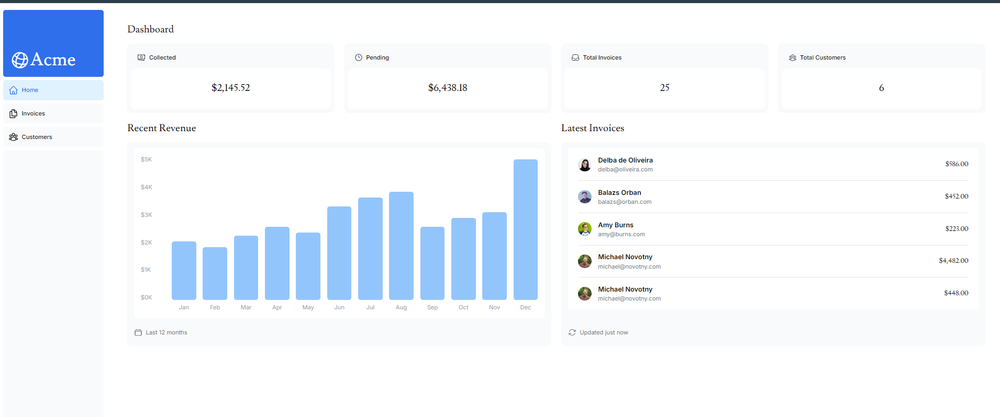

### Project Description: Full-Stack Dashboard Application with Next.js 14

#### Introduction
This project focuses on developing a comprehensive full-stack web application using Next.js 14. The dashboard application leverages the Next.js App Router, which simplifies routing and enhances performance with built-in features. The primary goal is to create a scalable and efficient dashboard that offers a seamless user experience, integrating various modern web technologies. The project will explore the benefits of Next.js and how it can be utilized to build robust applications with optimized performance.

#### Getting Started
To begin, the development environment is set up for Next.js, including the installation of necessary tools and dependencies. The project starts with a Next.js dashboard starter example, providing a foundational structure to build upon. The initial project setup includes exploring the file structure, understanding basic configurations, and running the application to ensure everything is working correctly.

#### CSS Styling
Tailwind CSS is introduced for styling the application, offering a utility-first approach for efficient design. Global styles and theme configurations are implemented to ensure consistency across the application. CSS modules are used for component-specific styling, and responsive design techniques are applied to adapt the layout for various screen sizes. Best practices are followed to maintain clean and efficient CSS.

#### Optimizing Fonts and Images
The application utilizes Next.js's built-in components to optimize font loading, improving performance. Efficient image loading strategies are implemented, including lazy loading and priority loading, to enhance the user experience. Best practices for handling assets are followed to ensure the application remains fast and responsive.

#### Creating Layouts and Pages
The dashboard's structure is designed to provide a coherent and user-friendly interface. Shared layouts are implemented for consistent UI across different pages. Individual pages and routes are created for various sections of the dashboard, using Next.js's file-based routing system. Components and pages are organized for scalability and maintainability.

#### Navigating Between Pages
Client-side navigation is handled using the Next.js `<Link>` component, creating a smooth and responsive navigation experience. A navigation menu is created for easy access to different parts of the dashboard, with active states managed to indicate the current page. Programmatic navigation is implemented for dynamic routing, and performance is optimized with prefetching and shallow routing techniques.

#### Setting Up Your Database
A robust database system, such as PostgreSQL, is selected and configured for the application. Database connections are set up in the Next.js environment, and necessary tables and schemas are created to store dashboard data. Initial data seeding scripts are implemented, and best practices for database management are followed to ensure data integrity and performance.

#### Fetching Data
Different data fetching methods provided by Next.js, including SSR, SSG, and ISR, are explored and implemented. API routes are created for server-side data fetching, and client-side data fetching is handled using tools like SWR or React Query. Loading states and error scenarios are managed to enhance user experience, and data fetching is optimized for performance.

#### Static and Dynamic Rendering
The project demonstrates the use of static and dynamic rendering techniques. Static generation is used for suitable pages, while server-side rendering is employed for dynamic content. Incremental static regeneration (ISR) is leveraged to update static content efficiently. The appropriate rendering strategy is chosen for different parts of the dashboard based on the content requirements.

#### Streaming
Streaming is implemented to improve the loading experience of the application. Loading skeleton components are created to provide visual feedback during data fetching, and progressive loading techniques are applied to enhance user experience. Edge cases and fallbacks are handled to ensure a smooth experience under various conditions.

#### Partial Prerendering
Partial Prerendering is introduced to balance static and dynamic content efficiently. Techniques for intelligent prerendering are implemented to optimize performance, and the impact of Partial Prerendering on the application is analyzed to ensure optimal user experience.

#### Adding Search and Pagination
A search functionality is designed and implemented to allow users to quickly find relevant data within the dashboard. Efficient search algorithms are created using Next.js APIs, and pagination is implemented to handle large datasets. Performance optimization techniques are applied to enhance search and pagination functionality, providing instant results for a better user experience.

#### Mutating Data
Data mutations are handled using React Server Actions, allowing for secure and efficient form submissions and data updates. Optimistic updates are implemented to provide a responsive user experience, and the Next.js cache is revalidated after data mutations. Error handling and rollback strategies are employed to ensure data integrity.

#### Handling Errors
Global error handling is implemented using a custom `error.tsx` component, and custom 404 pages are created using the `notFound` component. API errors are handled and displayed gracefully, and error boundaries are used for component-level error management. Error logging and monitoring are set up to track issues in the production environment.

#### Improving Accessibility
Accessibility is a priority, with server-side form validation implemented for better accessibility. Keyboard navigation is enhanced throughout the dashboard, and ARIA labels and roles are added to improve screen reader compatibility. Focus management is implemented for modal dialogs and dynamic content, and the application is tested and audited for accessibility compliance.

#### Adding Authentication
NextAuth.js is integrated to handle authentication securely. Login and logout functionalities are implemented, and dashboard routes are protected using authentication middleware. User roles and permissions are managed, and secure Server Actions are used for authenticated operations.

#### Adding Metadata
Dynamic metadata is implemented for SEO optimization, including Open Graph tags for improved social media sharing. Structured data is added for rich search results, and metadata is optimized for different page types within the dashboard. Testing and verification ensure the metadata is correctly implemented and effective.